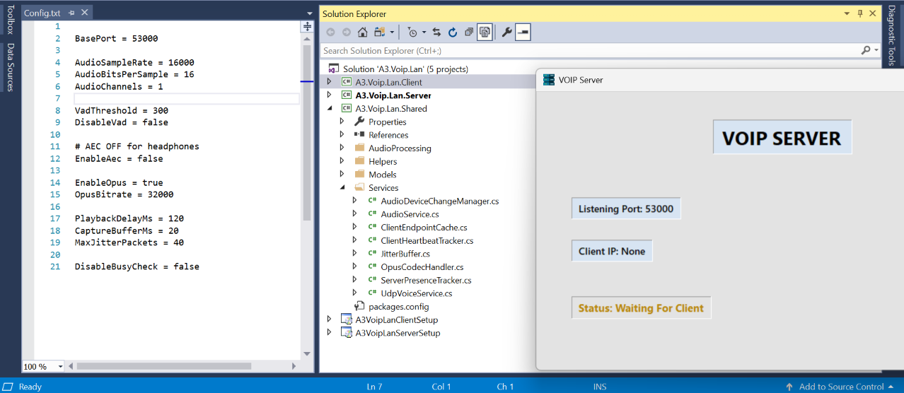
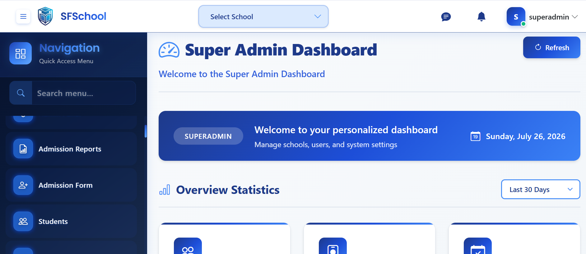
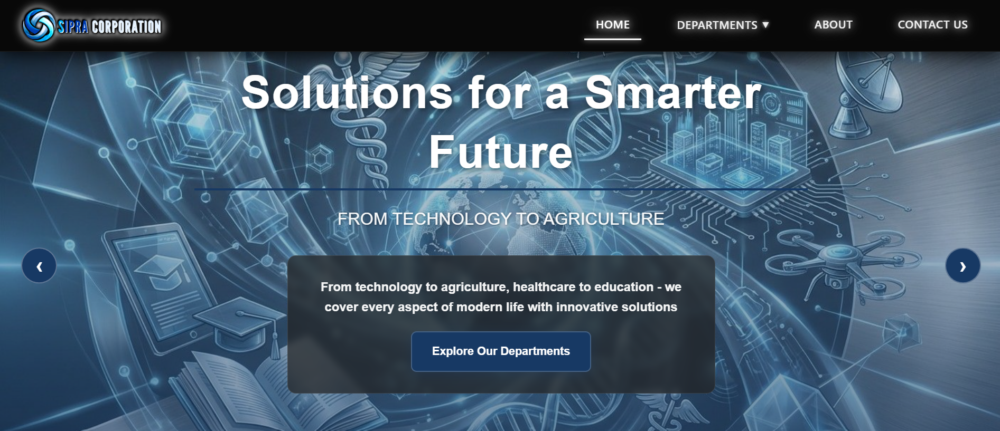
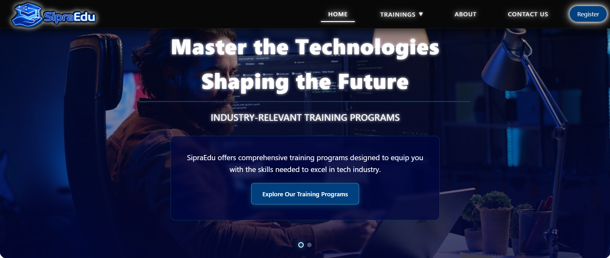
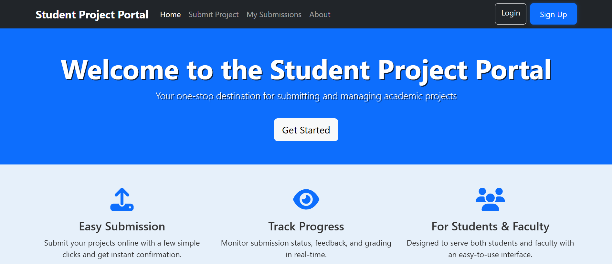
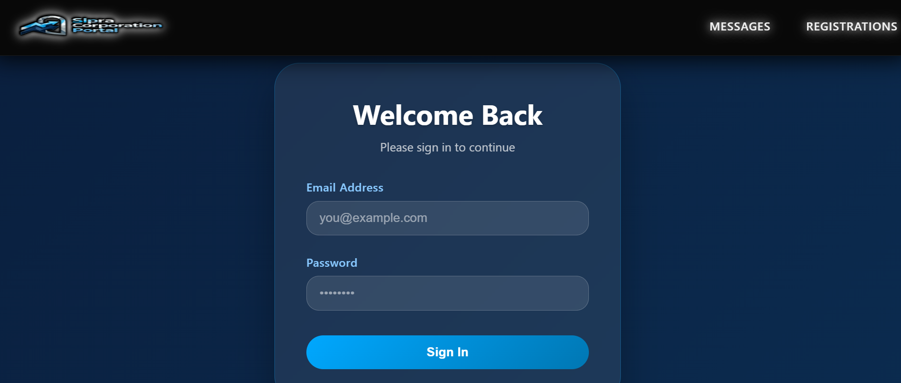

<!-- Animated Typing Banner -->

  

 

<!-- Profile Picture + Introduction -->

  
  <h2>Sawira Manzoor</h2>
  <h4>Software Engineer • React & .NET Developer</h4>
  

    
    
    
    
    
  

  
📍 Rahim Yar Khan, Punjab, Pakistan

 

---

## 👋 About Me

I'm a **Software Engineer** and **BS Computer Science student** at Islamia University Bahawalpur (RYK Campus).  
I have over **1.5 years of hands‑on experience** building modern web applications, enterprise management systems, and real‑time communication platforms. I love crafting clean UIs and scalable backends.

- 🎓 BS Computer Science (current)
- ⚛️ Specializing in **React** & **.NET**
- 🎙 Built a full LAN‑based **VoIP system**
- 🏢 Developed a complete **School ERP**
- 🌐 Created multiple corporate websites
- 🔥 Experienced with Firebase & SQL Server
- 📡 Deep interest in networking & audio codecs

---

## 🛠️ Tech Stack

  

---

## 📈 GitHub Stats

  
  
  
   
  
  
  
   
  
  
  
   
  
  
  
   
  
  
  
   
  
  

 

---

## ⭐ Featured Projects

### 💬 LAN VoIP Communication System  
> *Real‑time voice over IP for local networks*

  

**Features**  
✅ Full Duplex Communication • ✅ Opus Codec • ✅ Noise Suppression • ✅ Echo Cancellation • ✅ Jitter Buffer • ✅ Packet Recovery • ✅ Device Switching

**Tech Stack**  
 
 
 
 

---

### 🏫 School Management System  
> *Enterprise ERP with role‑based portals*

  

**Features**  
👩‍🏫 Admin Panel • 👨‍🎓 Student Portal • 👩‍🏫 Teacher Portal • 💰 Fee Management • 📊 Reports • 🔐 Authentication

**Tech Stack**  
 
 

---

### 🌐 Sipra Corporation Website  
> *Modern corporate website with smooth animations*

  

**Tech Stack**  
 
 

---

### 🎓 Sipra Educational Platform  
> *Training institute website with course listings & enrollment*

  

**Features:** Course listings, instructor profiles, admission forms, responsive design.

**Tech Stack**  
 
 

---

### 📚 Student Portal  
> *Firebase‑powered student dashboard*

  

**Features:** View grades, attendance, assignments, announcements.

**Tech Stack**  
 

---

### 📧 Mail Management Portal  
> *Full‑stack mail tracking and management app*

  

**Tech Stack**  
 

---

## 💼 Experience

### **React Frontend Developer** (2025)  
Built multiple responsive business websites with React, Bootstrap, and modern CSS.  
Focused on reusable components, performance, and UI/UX.

### **Full Stack Web Developer** (2025 – 2026)  
Developed corporate and educational platforms, landing pages, and Firebase‑integrated apps.  
Worked with REST APIs and real‑time data.

### **Software Engineering Projects** (2026 – Present)  
Designing complete solutions including a School ERP and a LAN‑based VoIP system.  
Working across frontend, backend, databases, and networking.

---

## 🏆 Achievements & Learning

- 🥇 Built a fully functional VoIP communication system from scratch
- 📚 Completed multiple real‑world projects for clients
- 🧠 Currently mastering **Advanced React**, **Clean Architecture**, and **System Design**
- 💡 Always exploring new technologies and best practices

---

## 📬 Let's Connect

I'm open to **internships**, **freelance projects**, **full‑time roles**, and **collaborations**.

  
  
  
  
  
  

 

  ⭐ <em>"Code with purpose. Build with passion."</em>
   
  <strong>Sawira Manzoor</strong> – Software Engineer

