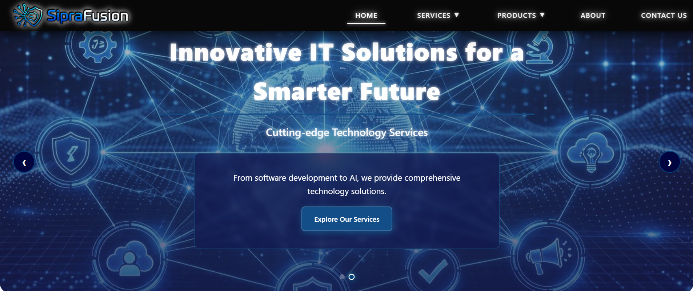
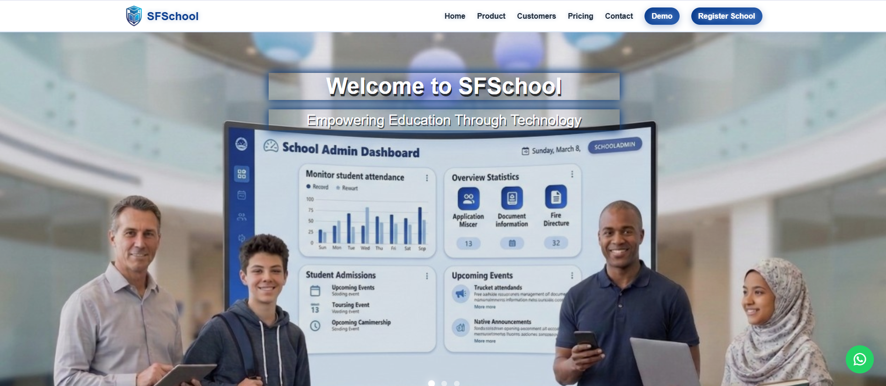

<!-- ========================================================= -->

<!-- ANIMATED PROFILE HEADER                                  -->

<!-- ========================================================= -->

  

 

<!-- ========================================================= -->

<!-- PROFILE INTRODUCTION                                     -->

<!-- ========================================================= -->

  <h2>Sawira Manzoor</h2>

  <h4>Software Engineer • React & .NET Developer</h4>

  

    
    
    
    
    
  

  
📍 Rahim Yar Khan, Punjab, Pakistan

 

---

<!-- ========================================================= -->

<!-- ABOUT ME                                                  -->

<!-- ========================================================= -->

## 👋 About Me

I'm a **Software Engineer** and **BS Computer Science student** at Islamia University Bahawalpur (RYK Campus), with **1.5+ years of practical software development experience**.

My experience includes **frontend development, C#/.NET application development, REST API integration, and backend technologies**. I have built web applications and interfaces using React and JavaScript, developed C#/.NET desktop applications, and worked with existing backend APIs and database-driven systems.

* 🎓 BS Computer Science
* ⚛️ React & JavaScript frontend development
* 💻 C# / .NET application development
* 🔗 REST API integration and testing
* 🏗️ Knowledge of C#/.NET backend development
* 🗄️ SQL Server, Firebase & database concepts
* 🖥️ .NET WinForms desktop development
* 🎙️ Built a LAN-based **VoIP communication system**
* 🏫 Developed frontend for a **multi-tenant SaaS School Management System**
* 🌐 Developed multiple corporate and educational websites
* 🚀 Currently strengthening my **full-stack web development** skills
* 📡 Interested in networking, real-time communication, and software engineering

---

<!-- ========================================================= -->

<!-- TECH STACK                                                -->

<!-- ========================================================= -->

## 🛠️ Tech Stack

  
  
  
  
  
  
  
  

   

  
  
  
  
  
  

 

**Frontend:** React • JavaScript • HTML5 • CSS3 • Bootstrap

**Backend / .NET:** C# • .NET • REST APIs • API Integration

**Database:** SQL Server • Firebase

**Desktop & Networking:** WinForms • UDP • LAN Networking • NAudio • Opus

**Tools:** Git • GitHub • Visual Studio • VS Code • Postman

---

<!-- ========================================================= -->

<!-- FEATURED PROJECTS                                        -->

<!-- ========================================================= -->

## ⭐ Featured Projects

<!-- ===================== VOIP ============================= -->

### 💬 LAN VoIP Communication System

> *C#/.NET WinForms desktop application for real-time voice communication over wired and wireless LAN networks*

**Application Type**

🖥️ Windows Forms Desktop Application • 📡 LAN Communication • 🎙️ Real-Time Voice Communication

**Features**

✅ Full-Duplex Voice Communication •
✅ Opus Codec •
✅ Noise Suppression •
✅ Echo Cancellation •
✅ Jitter Buffer •
✅ Packet Recovery •
✅ Audio Device Switching •
✅ Wired & Wireless LAN Support

**My Contribution**

Designed and developed the WinForms desktop application using **C#/.NET**, including the client/server architecture, UDP-based LAN communication, real-time audio capture and playback, audio processing, device handling, and communication reliability features.

**Tech Stack**

---

<!-- ================= SCHOOL SYSTEM ======================== -->

### 🏫 Multi-Tenant SaaS School Management System

> *Multi-tenant SaaS school management platform with role-based portals and academic management modules*

**Features**

👨‍💼 Admin Portal •
👨‍🎓 Student Portal •
👩‍🏫 Teacher Portal •
👨‍👩‍👧 Parent Portal •
📝 Admission Management •
📊 Reports •
📚 Course Material •
📖 Library Management •
🚌 Drivers & Routes •
🚌 Bus Management •
🪪 Student Cards •
📋 Results & Report Cards •
📅 Exam Timetable •
🕒 Attendance •
🔔 Notifications •
💬 Chat

**My Contribution**

* 🎨 Developed the frontend using **JavaScript**
* 📊 Built dashboards, forms, and data-driven interfaces
* 🔗 Integrated frontend functionality with existing **REST APIs**
* 🧪 Tested API endpoints and application functionality
* 🔐 Implemented frontend authentication and role-based interfaces
* 🏢 Worked on the frontend of a **multi-tenant SaaS school management system**

**Technology**

  

---

<!-- ================= SIPRA CORPORATION ==================== -->

### 🌐 Sipra Corporation Website

> *Modern corporate website with smooth animations*

**Technology**

  

---

<!-- ================= SIPRA FUSION ========================== -->

### 🔷 Sipra Fusion Website

> *Corporate website for a technology-focused business division*

**Technology**

  

---

<!-- ================= SIPRA EDUCATION ======================= -->

### 🎓 Sipra Educational Platform

> *Training programs website with course listings and registration*

**Features**

📚 Training Programs •
📝 Program Registration •
📋 Course Information •
📞 Contact & Inquiry •
📱 Responsive Design

**Technology**

  

---

<!-- ================= SFSCHOOL LANDING ===================== -->

### 🏫 SFSchool Landing Page

> *Modern landing page for a multi-tenant school management platform*

**Features**

🌐 Modern Responsive Landing Page •
🏫 School Management Platform Overview •
📋 Platform Features & Modules •
📞 Contact & Inquiry Sections •
📱 Responsive Design

**My Contribution**

* 🎨 Developed the frontend landing page using **JavaScript**
* 🧩 Created responsive UI sections and interactive components
* 📱 Optimized the interface for desktop and mobile screens
* 🔗 Integrated frontend functionality with APIs where required

**Technology**

  

---

<!-- ================= CAVE SCHOOL =========================== -->

### 🏫 Cave School Landing Page

> *Modern, responsive landing page for the Cave School management platform*

**Features**

🌐 Responsive Landing Page •
🏫 School Platform Overview •
📋 Platform Features & Modules •
📞 Inquiry Sections •
📱 Responsive Design

**Technology**

  

---

<!-- ================= STUDENT PORTAL ======================== -->

### 📚 Student Portal

> *Firebase-powered student dashboard*

**Features**

📊 View Grades •
🕒 Attendance •
📝 Assignments •
📢 Announcements •
👩‍🏫 Teacher Dashboard •
📋 Assignment & Grade Management

**Technology**

---

<!-- ========================================================= -->

<!-- EXPERIENCE                                                -->

<!-- ========================================================= -->

## 💼 Experience

### **React / Frontend Developer** (2025)

Developed multiple responsive business and corporate websites using **React, JavaScript, Bootstrap, HTML, and CSS**.

* 🌐 Built the **Sipra Corporation** website
* 🔷 Developed the **Sipra Fusion** corporate website
* 🎓 Developed the **Sipra Educational Platform**
* 📱 Created responsive interfaces and reusable components
* 🎨 Focused on UI/UX, responsive design, and frontend functionality

### **Web Developer — SaaS & API Integration** (2025–2026)

Worked on a **multi-tenant SaaS School Management System** and other web applications.

* 🏫 Developed frontend interfaces using **JavaScript**
* 🔗 Integrated and tested **REST APIs**
* 📊 Built dashboards, forms, portals, and data-driven views
* 🔐 Worked with role-based interfaces and authentication flows
* 🧩 Worked with existing **C#/.NET backend services**
* 🗄️ Worked with database-driven application functionality

### **Software Engineering Projects** (2026–Present)

Developing software projects involving **C#/.NET, networking, real-time communication, and application development**.

* 🎙️ Designed and developed a **LAN-based VoIP communication system**
* 💻 Worked with **C#/.NET and UDP networking**
* 🔊 Implemented real-time audio capture, processing, and playback
* 📡 Worked with wired and wireless LAN communication
* 🧠 Continuing to strengthen **full-stack web development and backend development skills**

---

<!-- ========================================================= -->

<!-- ACHIEVEMENTS                                              -->

<!-- ========================================================= -->

## 🏆 Achievements & Learning

* 🥇 Built a fully functional **LAN-based VoIP communication system** from scratch
* 🌐 Developed multiple real-world corporate and educational websites
* 🏫 Developed frontend for a **multi-tenant SaaS School Management System**
* 🔗 Worked with REST API integration and API testing
* 💻 Hands-on experience with **React, JavaScript, C# and .NET**
* 🧠 Currently strengthening **full-stack web development, backend development, and software architecture**
* 📚 Continuously improving Git, GitHub, databases, APIs, and software engineering practices

---

<!-- ========================================================= -->

<!-- GITHUB STATS                                             -->

<!-- ========================================================= -->

## 📈 GitHub Stats

 

<!-- ========================================================= -->

<!-- ANIMATED SKILLS LINE                                     -->

<!-- ========================================================= -->

  

 

---

<!-- ========================================================= -->

<!-- CONNECT                                                  -->

<!-- ========================================================= -->

## 📬 Let's Connect

I'm open to **internships**, **freelance projects**, **full-time roles**, and **collaborations**.

  

  

  

  

  

  

 

<!-- ========================================================= -->

<!-- FOOTER                                                    -->

<!-- ========================================================= -->

⭐ <em>"Code with purpose. Build with passion."</em>

   

<strong>Sawira Manzoor</strong> – Software Engineer

