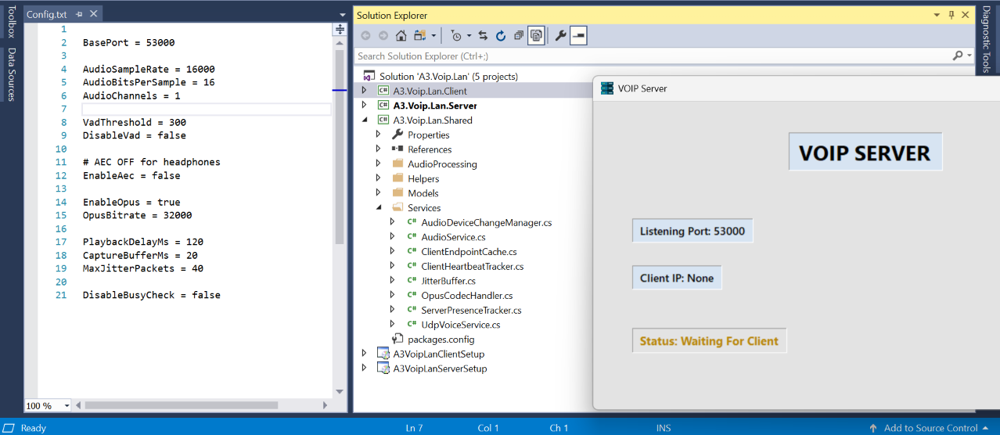
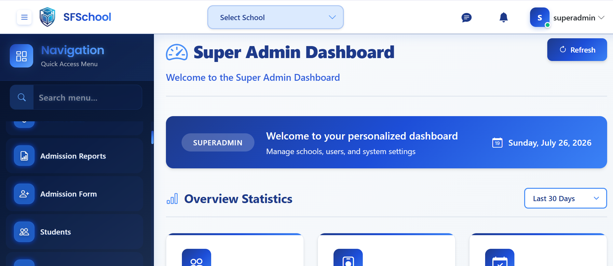
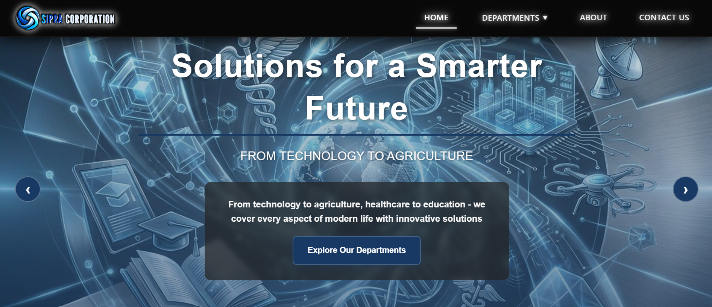
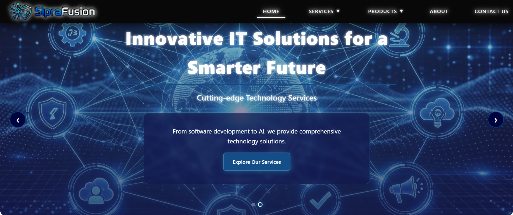
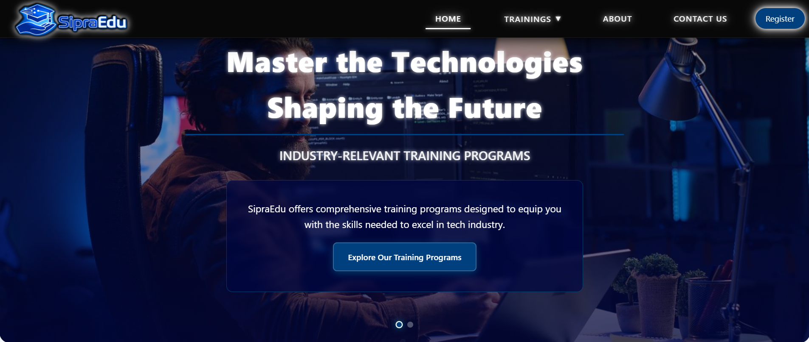
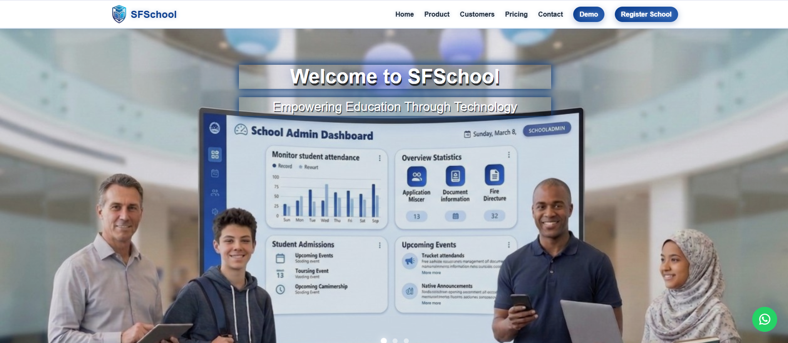
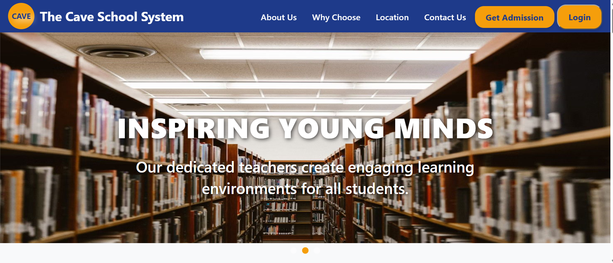
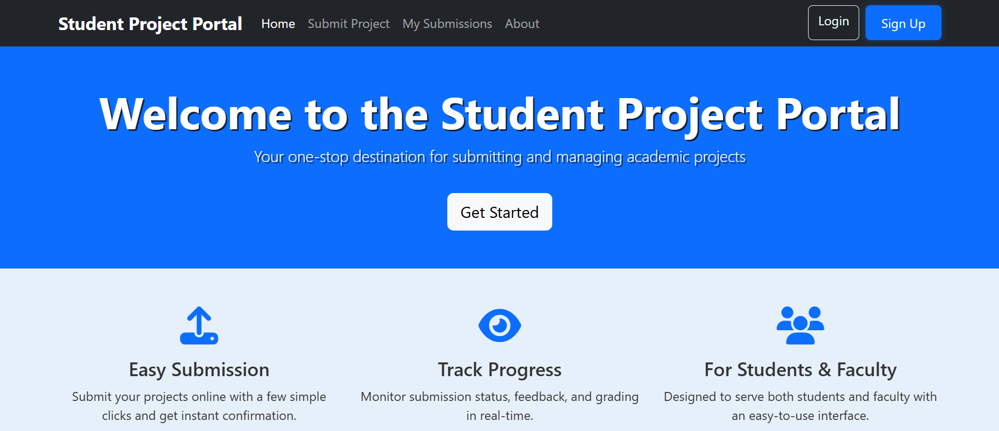

<!-- ===================================================== -->

<!-- HEADER -->

<!-- ===================================================== -->

 

<h1>Sawira Manzoor</h1>

<h3>Software Engineer • React & .NET Developer</h3>

  
  
  
  

  📍 Rahim Yar Khan, Punjab, Pakistan

---

# 👩‍💻 About Me

I’m a **7th-semester Computer Science student** with **1.5+ years of practical software development experience** at Sipra Corporation.

My strongest hands-on experience includes **React/JavaScript frontend development, C#/.NET application development, REST API integration/testing, and database-driven applications**.

I have worked on corporate and educational websites, a multi-tenant SaaS School Management System, and a real-time LAN-based VoIP desktop application.

### What I Work With

* 🎓 BS Computer Science — 7th Semester
* ⚛️ React & JavaScript frontend development
* 💻 C# & .NET application development
* 🔌 REST API integration & testing
* 🗄️ SQL Server & Firebase
* 🖥️ .NET WinForms desktop applications
* 📡 UDP & LAN networking
* 🎙️ Real-time VoIP communication
* 🏫 Frontend development for a multi-tenant SaaS School Management System
* 🌐 Corporate & educational websites
* 🚀 Currently strengthening ASP.NET Core and backend development

---

# 🛠️ Tech Stack

### Frontend

### Backend & APIs

### Database

### Desktop & Networking

### Tools

---

# 🚀 Featured Projects

## 💬 LAN VoIP Communication System

> **C#/.NET WinForms desktop application for real-time voice communication over wired and wireless LAN networks.**

  

### Application Type

🖥️ Windows Forms Desktop Application
📡 LAN Communication
🎙️ Real-Time Voice Communication

### Features

* 🔊 Full-Duplex Voice Communication
* 🎵 Opus Audio Compression
* 🎧 Real-Time Audio Capture & Playback
* 🔇 Noise Suppression
* 🚫 Echo Cancellation
* 📦 Jitter Buffer
* 🔄 Packet Recovery
* 🎙️ Audio Device Switching
* 🌐 Wired & Wireless LAN Communication
* 🔌 UDP Client/Server Communication

### Contribution

Designed and developed the WinForms desktop application using **C#/.NET**, including the client/server architecture, UDP-based LAN communication, real-time audio capture and playback, audio processing, device handling, and communication reliability features.

**Technology:** C# • .NET • UDP • NAudio • Opus

---

## 🏫 Multi-Tenant SaaS School Management System

> **Multi-tenant SaaS School Management System with role-based portals and academic management modules.**

  

### Features

* 👨‍💼 Admin Portal
* 👨‍🎓 Student Portal
* 👨‍🏫 Teacher Portal
* 👪 Parent Portal
* 📝 Admission Management
* 📊 Reports
* 📚 Course Material
* 📖 Library Management
* 🚌 Drivers & Routes
* 🚍 Bus Management
* 🪪 Student Cards
* 📋 Results & Report Cards
* 🗓️ Exam Timetable
* 📅 Attendance
* 🔔 Notifications
* 💬 Chat

### Contribution

* Developed frontend interfaces using **JavaScript**
* Built dashboards, forms, and data-driven views
* Integrated existing **REST APIs**
* Performed API/application testing
* Worked on frontend authentication and role-based interfaces
* Contributed to the frontend of a multi-tenant SaaS school management platform

**Technology:** JavaScript • C# • .NET • REST API • SQL Server

---

## 🌐 Sipra Corporation Website

> **Corporate website developed with React and modern responsive web technologies.**

  

**Technology:** React • Bootstrap • CSS3 • JavaScript

---

## 🔷 Sipra Fusion Website

> **Modern corporate technology website built with React and responsive UI components.**

  

**Technology:** React • JavaScript • Bootstrap • CSS3

---

## 🎓 Sipra Educational Platform

> **Educational platform website showcasing training programs, courses, registration and contact information.**

  

**Technology:** React • JavaScript • CSS3 • Bootstrap

---

## 🏫 SFSchool Landing Page

> **Responsive landing page for the SFSchool multi-tenant school management platform.**

  

**Technology:** JavaScript • HTML5 • CSS3 • Bootstrap

---

## 🏫 Cave School Landing Page

> **Responsive landing page for the Cave School management platform.**

  

**Technology:** JavaScript • Bootstrap • CSS3

---

## 📚 Student Portal

> **Firebase-powered student dashboard for academic activities and assignment management.**

  

**Technology:** HTML5 • CSS3 • JavaScript • Firebase • Bootstrap

---

# 📊 GitHub Activity

 

---

# 💼 Experience

### React / Frontend Developer

**Sipra Corporation • 2025**

* Developed React-based corporate and educational websites
* Created responsive interfaces and reusable components
* Worked with JavaScript, Bootstrap and CSS3
* Implemented UI/UX improvements across multiple web projects

### Web Developer — SaaS & API Integration

**2025 – 2026**

* Worked on the frontend of a multi-tenant SaaS School Management System
* Developed JavaScript dashboards, forms and data-driven interfaces
* Integrated and tested existing REST APIs
* Worked with role-based interfaces and authentication flows
* Worked with database-driven application functionality

### Software Engineering Projects

**2026 – Present**

* Developed a C#/.NET WinForms LAN VoIP application
* Implemented UDP-based client/server communication
* Worked with real-time audio capture, processing and playback
* Implemented networking and communication reliability features
* Currently strengthening ASP.NET Core and backend development skills

---

# 🏆 Achievements & Highlights

* 🚀 Developed a LAN-based VoIP application from scratch
* 🌐 Built corporate and educational websites using React
* 🏫 Contributed to the frontend of a multi-tenant SaaS School Management System
* 🔌 Integrated and tested REST APIs
* 💻 Hands-on experience with C#, .NET and WinForms
* ⚛️ React & JavaScript frontend development
* 📡 Practical experience with UDP and LAN networking
* 🗄️ Experience with SQL Server and Firebase
* 🔧 Continuously strengthening backend and full-stack development skills

---

# 📫 Connect With Me

---

### 💙 Building software, learning continuously, and turning ideas into real applications.

 

